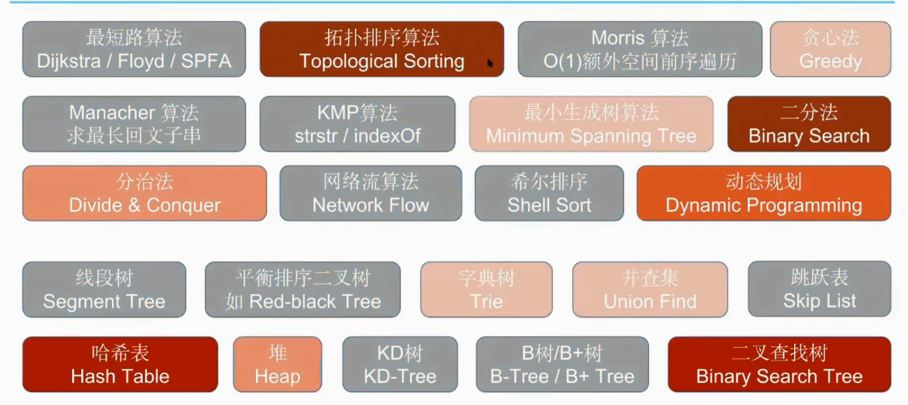

缺乏项目经验
- 耦合度高 
- 重复代码 
- 全局变量

代码耦合度（Coupling）高容易导致：
难维护
难读懂
易出错

解决办法：解耦合 Decouple
拆散一对是一对
劝分不劝合

使用含义清晰的变量名命名+简单易读的处理逻辑
>>
用注释去解释让人看不懂的代码

通过适当的子函数化的代码包装，多加空行
虽然代码更长了，但是能够让你的代码：
易读，易维护，不易错

Coding(Algorithm) Interview 的评价体系主要有如下一些方面
Logicality / Code Quality / Communication

Logicality 逻辑思维能力
- 是否能很快的想到一个 Work Solution 
- 是否能够在面试官点出问题后优化自己的 Solution
Code Quality 代码质量
- 代码到底写完没有 
- 代码风格好不好 
  - 可读性 
  - 变量名、函数名命名 
  - 空格与空行的正确使用 
- 异常检测 
- Bug Free

做一个题之前，先沟通清楚，得到面试官肯定，再开始写代码，写完以后再解释
•不要闷头写
也不要一边写一边解释太多（容易写不完）
可以要提示，经过提示做出来的题，也是可以拿到 Hire 的
•但是先自己努力想一下，别太容易放弃，容易让人觉得不会主动思考问题
•别和面试官吵架
面试官带着答案来面试你的
不同意见在大部分情况下，都是你自己想错了

考察频率

通过单词阶梯川这个题目，能够：
练习最复杂版本的 BFS 代码
练习 DFS
理解 Hash 函数的时间复杂度
锻炼子函数化的能力

通过 LRU 这个题，能够：
练习数据结构设计类问题
熟练链表操作（单向链表＆双向链表）
锻炼子函数化能力

通过K个有序数组中位数问题，能够：
同时练习传统二分法和二分答案算法
锻炼时间复杂度的分析能力
锻炼子函数化的能力
